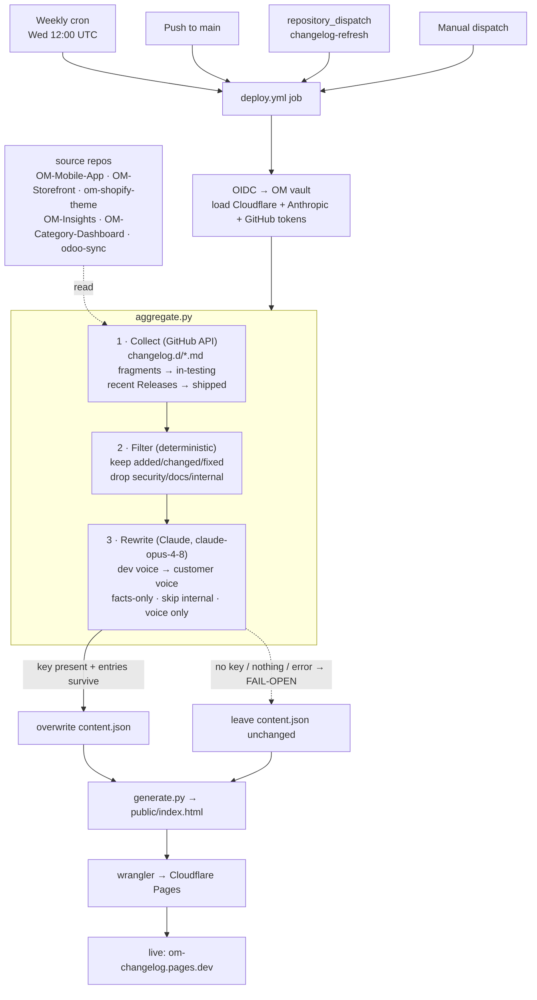
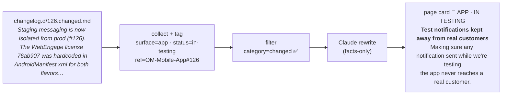

# Auto-aggregated changelog (OM-Infra#86)

The page is **zero-touch**: `aggregate.py` runs in `deploy.yml` before
`generate.py` and rebuilds `content.json` on every deploy — no one edits it by
hand.

## Flow

`surface` / `status` / `date` / `ref` are set in code (blue path); Claude only
controls wording. If the key is absent the run takes the dotted fail-open path
and the last good page still deploys.

### What one entry looks like as it moves through

A `93.security.md` fragment would be dropped at the **filter** step and never
reach the page.

## How it works

1. **Source (deterministic).** For each product repo in `aggregate.py:SOURCES`,
   it reads the human-authored `changelog.d/*.md` fragments (already written per
   PR and CI-enforced) → **In testing now**, and recent published GitHub Releases
   → **Shipped**. Every entry is a line a human already wrote and reviewed.
2. **Filter (deterministic).** Only customer-facing categories
   (`added`/`changed`/`fixed`) pass; `security`/`docs`/internal are dropped
   before anything leaves the repo — the audience gate.
3. **Rewrite (Claude).** `claude-opus-4-8` rewrites each dev-voice line into the
   page's customer voice (title / body / optional "why it matters"),
   **constrained to the facts in the source line** — it may not invent, and it
   marks purely-internal lines `skip`. Surface/status/date/ref are set
   deterministically in code, not by the model, so it only controls wording.
4. **Publish.** The result overwrites `content.json`; `generate.py` renders it;
   wrangler deploys to Cloudflare Pages.

`repo → surface` and the category allowlist live at the top of `aggregate.py` —
edit there.

## Fail-open

If `ANTHROPIC_API_KEY` (or a GitHub token) is missing, or aggregation yields
nothing, `aggregate.py` logs a notice and **leaves `content.json` untouched**, so
the deploy still ships the last good page. Nothing breaks before the secrets
exist — auto-aggregation simply switches on once they do.

## Owner action — provision one vault secret

Auto-aggregation activates when this is in the OM vault (AWS Secrets Manager,
same account/region the Cloudflare token uses):

- **`om/anthropic-api-key`** — an Anthropic API key. **Required.**
- `om/github-changelog-reader` *(optional)* — a GitHub token that can read the
  source repos' contents + releases. Only needed if any source repo is
  **private**; public repos are read with the workflow's own `GITHUB_TOKEN`.

No GitHub repo secrets and no code change are needed — the deploy reads these via
OIDC exactly like `om/cloudflare-api-token`. Until then the page keeps serving its
current curated `content.json`.

## Not automated (by design)

Weekly cadence is the scheduled `deploy` run (Wed 12:00 UTC) plus any push /
`repository_dispatch: changelog-refresh`. There is no live per-merge trigger yet;
if wanted, have each repo's release workflow send a `changelog-refresh`
repository_dispatch to OM-Changelog.
